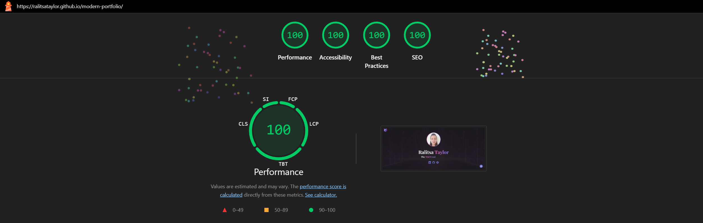
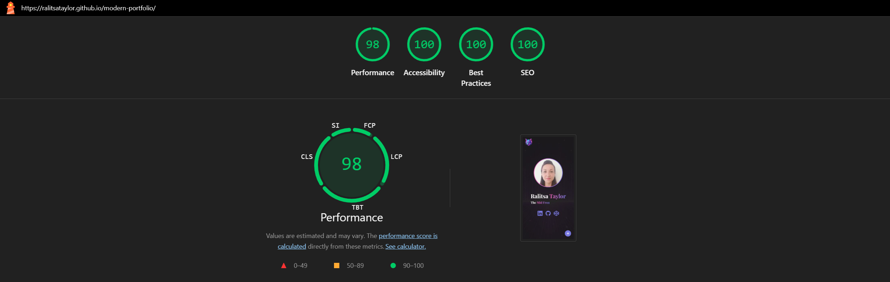
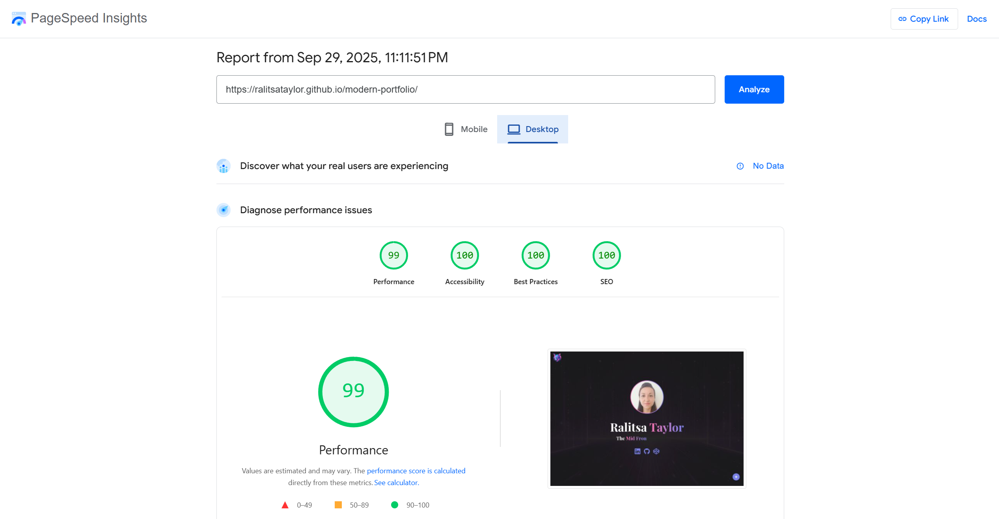
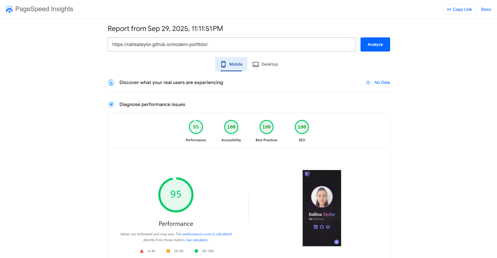

# 🚀 Modern Portfolio

📝 [CodePen](https://codepen.io/ralitsataylor/pen/KOdQJZ/)
🔗[Live GitHub Preview](https://ralitsataylor.github.io/modern-portfolio/)

<table>
  <tr>
    <td colspan="2">🖥️ Desktop preview:</td>
  </tr>
  <tr>
    <td></td>
    <td></td>
  </tr>
</table>

<table>
  <tr>
    <td colspan="2">📱 Tablet preview:</td>
  </tr>
  <tr>
    <td></td>
    <td></td>
  </tr>
</table>

<table>
  <tr>
    <td colspan="2">📱 Mobile Preview:</td>
  </tr>
  <tr>
    <td></td>
    <td></td>
  </tr>
 </table>

 

# 🏅 W3C HTML Validator

 

# 🏅 W3C CSS Validator

 

# 🌈 Chrome LightHouse Audit

Desktop:

 

Mobile:

 

# ⚡ PageSpeed Insights Results

Desktop:

 

Mobile:

         
                                                                                                                                              
# 🛠️ Built with:

                                                                                                                                               
                
🔨 SCSS Files [Responsiveness, Grid template areas, Flex Layout, transitions, mixins, etc.]                                                      
⛏️ [Google Font: Playfair Display](https://fonts.google.com/specimen/Playfair+Display/)                                                          
🪓 [Bootstrap v5.3](https://getbootstrap.com/docs/5.3/getting-started/introduction/)                                                             
🪛 [Dev Icons](https://devicon.dev/)                                                                                                                 
🔩                                                                    

# ✨ Features:
✅ A modern Bootstrap Portfolio Website                                                                              
✅ Custom-styled Timeline with elegant Bootstrap Cards                                                                                         
✅ Reference to Brendan Eich's Wikipedia Page                                                                                                     
✅ Custom-styled Mr. Eich's Famous Quote                                                                                                          
✅ Related Social and Info Links                   
✅ Stylish Popup Menu                                                                                                                                  
✅ manifest.json                                                                                                                                       
✅ sitemap.xml                                                                                                                                         
✅ robots.txt                                                                                                                                         

# 🧰 Online resources and tools:
                      
🖼️ [Photopea [Online Photo Editor]](https://www.photopea.com/)                                                                        
🪄 [svg-to-png & svg minification](https://www.svgviewer.dev/)     
💫 [svg online cropping tool](https://svgcrop.com/)                                                          
⭐ [jpg-to-webp free converter](https://www.freeconvert.com/jpg-to-webp/)         
🌃 [favicon converter](https://favicon.io/favicon-converter/)                                                                                    

# 🌐 Browser Support:
(Last updated and tested: 27/09/2025)                                                                                                            
🌟 Chrome 140.0.7339.186 (64-bit)                                                                                                           
🦊 Firefox 143.0.1 (64-bit)                                                                                                                 
🏴‍☠️ Opera 122.0.5643.51 (64-bit)                                                                                                        
🪟 Edge 140.0.3485.81 (64-bit)                                                                                                                   

# 🧪 Online Validators:
✔️ [W3C HTML Validator](https://validator.w3.org/)                                                                                               
✔️ [W3C CSS Validator](https://jigsaw.w3.org/css-validator/)                                                                                     
💡 [LightHouse Audit](https://developers.google.com/web/tools/lighthouse/)                                                                       
⚡ [PageSpeed Insights Audit](https://pagespeed.web.dev/)         
⭐ [WebPageTest](https://www.webpagetest.org/)                                                                                                    

# 🌟 Inspiration & Credits:                                          
🎞️ [Pure JavaScript Type Writer Effect YouTube Tutorial](https://www.youtube.com/watch?v=POX3dT-pB4E)                                           
🎞️ [Pure JavaScript Type Writer Effect Project in CodePen](https://codepen.io/bradtraversy/pen/jeNjwP)                                          
📝 [Floating Action Button with Popup Menu [ELEMENTS]](https://codepen.io/RaduBratan/pen/eYJZLpN)                                                

---
  
🙌 Thanks for checking out my project! More coming 🔜.                                                                                           
Stay tuned 🚀 and don't forget to give the project a star!                                                                                       
⭐ Made with lots of 💗, ☕, and a sprinkle of ✨ by Ralitsa Taylor!                                                                                